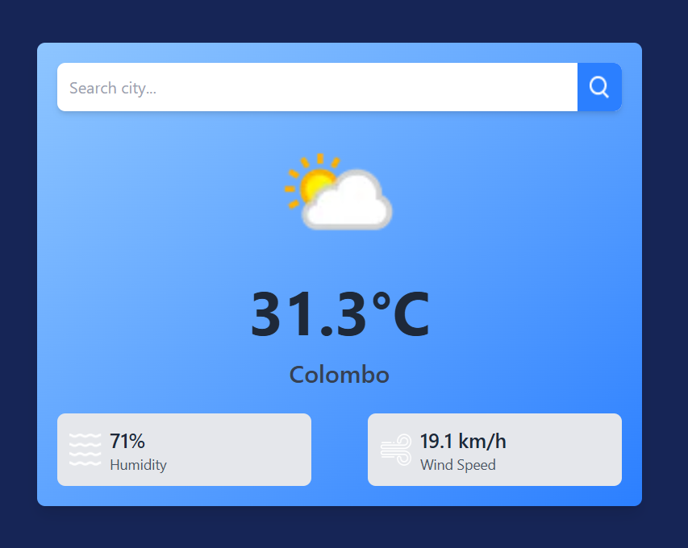

# React Weather App

A weather application built with React and Tailwind CSS that fetches real-time weather data using the WeatherAPI.

## Features

- **Real-time Weather Data**: Displays current temperature, humidity, and wind speed
- **Location-based Weather**: Default location set to Colombo with ability to search any city
- **Visual Weather Indicators**: Shows appropriate weather icons based on conditions
- **Modern UI**: Clean interface with gradient backgrounds and card-based layout

## Error Handling

This application includes robust error handling to ensure a smooth user experience:

- **Empty Search Validation**: Prevents API calls with empty search terms
- **API Error Management**: Catches and displays meaningful error messages from the API
- **Failed Request Handling**: Gracefully handles network errors and API failures
- **User Feedback**: Provides clear alert messages when errors occur
- **State Management**: Resets weather display when errors occur to prevent displaying incorrect data

## Technology Stack

- **React 19**: Latest version of React for building the UI
- **Tailwind CSS**: Utility-first CSS framework for styling
- **WeatherAPI**: Third-party API for accurate weather data (weatherapi.com)
- **Environment Variables**: Secure API key management using .env

## Project Structure

- `/src`: Source code
  - `/assets`: Weather and UI icons
  - `/components`: React components including Weather.jsx
  - `App.jsx`: Main application component
  - `main.jsx`: Application entry point
  - `index.css`: Global styles and Tailwind imports

